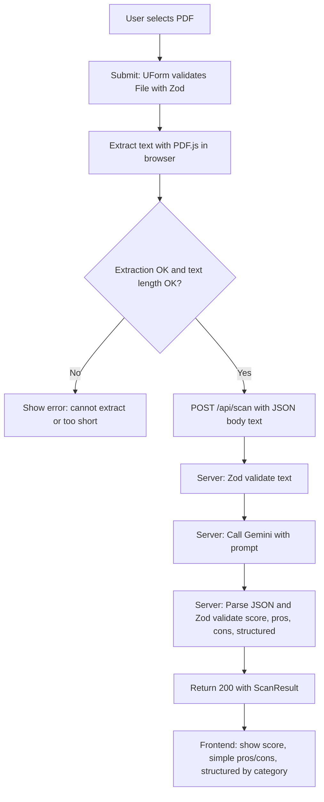

# ATS Scan: PDF Upload, Extraction, Gemini Analysis, and Score

## 1. Response shape (and Zod schema)

Gemini will be prompted to return JSON in this shape:

```ts
{
  score: number,        // 0–100
  pros: string[],
  cons: string[],
  structured: {
    categories: Array<{
      name: string,     // e.g. "Formatting", "Content", "ATS-friendly"
      pros: string[],
      cons: string[]
    }>
  }
}
```

A shared Zod schema will validate this (and the API will re-validate the parsed JSON).

---

## 2. Dependencies

- **zod** – validation (frontend form + backend text and Gemini response). Add as direct dependency (Nuxt UI may already pull it; we need it explicitly).
- **pdfjs-dist** – client-side text extraction. Use the default build; set `GlobalWorkerOptions.workerSrc` to the published worker (e.g. from `node_modules` or a copy in `public/`).
- **@google/generative-ai** – server-only; used in the API route to call Gemini. API key from `runtimeConfig` (`NUXT_GEMINI_API_KEY`).

---

## 3. Frontend: [app/pages/scan.vue](app/pages/scan.vue)

- Wrap the existing `UPageHero` + `UFileUpload` in **UForm** + **UFormField** (same pattern as the [Nuxt UI FileUpload Form validation example](https://ui.nuxt.com/docs/components/file-upload#with-form-validation)):

  - **State**: `reactive({ pdf: undefined as File | undefined })`.
  - **Zod schema** for `pdf`:
    - `z.instanceof(File, { message: 'Please select a PDF.' })`
    - `.refine(f => f.size <= 5 * 1024 * 1024, 'Max 5MB.')`
    - `.refine(f => f.type === 'application/pdf', 'Only PDF.')`
  - **UFileUpload** `v-model="state.pdf"` with `accept="application/pdf"`, `max-files` effectively 1 (no `multiple`). Keep `max-size` and `max-files` as UX hints only; Zod enforces.

- **Submit handler** (`onSubmit`):

  1. If validation fails, UForm will show errors; return.
  2. **Extract text in the browser** with `pdfjs-dist`:

     - `getDocument({ data: await file.arrayBuffer() })` (or equivalent) → for each page `getTextContent()` → concatenate `items.map(i => i.str).join(' ')` (and optional `\n` between pages).
     - Run this in a `try/catch`; on failure, set a form or page-level error (e.g. “Could not extract text from this PDF”).

  1. **Optional client-side check**: if extracted text is too short (e.g. `< 50` chars), show an error and stop.
  2. **POST to the API** with the extracted text only (no file):
     ```ts
     $fetch('/api/scan', {
       method: 'POST',
       body: { text: extractedText },
       // or Content-Type: application/json with { text }
     })
     ```

  1. On success, store the API response in a `ref` (e.g. `result`) and show the results in a new section below the form. On error (4xx/5xx), map to a user-friendly message.

- **PDF.js worker**: configure once (e.g. in a client-only `onMounted` or in a small `client` plugin, or at the top of the extraction logic when it first runs). Use the worker from `pdfjs-dist`:
  ```ts
  import * as pdfjsLib from 'pdfjs-dist'
  pdfjsLib.GlobalWorkerOptions.workerSrc = `//cdnjs.cloudflare.com/ajax/libs/pdf.js/${pdfjsLib.version}/pdf.worker.min.mjs`
  // or from /assets, /public, or a copy in public after build
  ```


Ensure this runs only on the client (e.g. behind `import.meta.client` or inside a `onMounted`/`client` plugin).

- **Results block** (shown when `result` is set):

  - **Score (0–100)**: prominent (e.g. big number + short label: “Resume score: X/100” or a simple gauge/color by band: 0–40 red, 41–70 yellow, 71–100 green).
  - **Simple pros/cons**: two lists (e.g. `UCard` or `ul` with `result.pros` and `result.cons`).
  - **Structured (by category)**: for `result.structured.categories`, render each `name` with its `pros` and `cons` (e.g. accordions or `UCard`s). Reuse Nuxt UI components where it fits.

- **Loading**: disable the submit button and/or show a `UProgress` or “Analyzing…” while `$fetch` is in progress.

---

## 4. Backend: API route and validation

- **New file**: `server/api/scan.post.ts`.

- **Input**: JSON body `{ text: string }`. Do **not** accept the PDF; the client sends only the extracted text.

- **Zod input schema**:
  ```ts
  const scanBodySchema = z.object({
    text: z.string().min(50, 'Text too short').max(100_000, 'Text too long')
  })
  ```

  - Parse `body` with `readBody(event)` (or `getRequestPayload`), then `scanBodySchema.safeParse(body)`.
  - If invalid, return `createError({ statusCode: 400, statusMessage: 'Invalid request', data: err.flatten() })` or similar.

- **Gemini**:
  - `import { GoogleGenerativeAI } from '@google/generative-ai'`
  - `const apiKey = useRuntimeConfig().geminiApiKey` (or `gemini?.apiKey` if nested). Require it; if missing, throw 500 with a clear message.
  - `new GoogleGenerativeAI(apiKey).getGenerativeModel({ model: 'gemini-1.5-flash' })` (or `gemini-1.5-pro` if you prefer).
  - **Prompt**: ask Gemini to act as an ATS/resume expert. Provide the `text` and require a JSON-only reply with exactly:

    - `score`: number 0–100 (overall resume quality for ATS and recruiters).
    - `pros`: array of short strings (3–5 main strengths).
    - `cons`: array of short strings (3–5 main improvements).
    - `structured`: `{ categories: [ { name, pros, cons } ] }` with 2–4 categories (e.g. “Formatting”, “Content”, “ATS-friendly”, “Impact”).

  - Instruct: “Return only valid JSON, no markdown or extra text.”

- **Parse and validate Gemini’s response** with a Zod schema matching the shape above (including `structured.categories`). If parsing fails, retry with a simpler prompt or return a 502 with “Analysis failed”.

- **Return** the validated object as JSON. The frontend will receive `{ score, pros, cons, structured }`.

---

## 5. Config and env

-  **nuxt.config.ts**:
  ```ts
  export default defineNuxtConfig({
    // ...
    runtimeConfig: {
      geminiApiKey: ''  // NUXT_GEMINI_API_KEY
    }
  })
  ```

- **.env** (and .env.example, gitignored for .env):
  ```
  NUXT_GEMINI_API_KEY=your_key
  ```

- **Nitro**: if the default body size is too small for very long CVs, you can raise it (e.g. in `nitro.routeRules` or `nitro` config). 100k chars is small; defaults are likely enough.

---

## 6. Shared Zod schema (optional but recommended)

- **New file**: `app/utils/scan.ts` (or `server/utils/scan.ts` if you want it server-only; for shared types, `app` or a `shared/` is better if both client and server can import).

  - Export `scanResponseSchema` and, if useful, `type ScanResult = z.infer<typeof scanResponseSchema>`.
  - The API imports and uses `scanResponseSchema.parse(JSON.parse(geminiText))` (or equivalent). The frontend can import the type for `result`.

  - If you prefer to avoid cross-boundary imports, duplicate a minimal schema on the server and only export the **type** from a types-only module for the frontend.

---

## 7. File and schema overview

| File | Role |

|------|------|

| [app/pages/scan.vue](app/pages/scan.vue) | UForm + UFormField + UFileUpload; Zod for `File`; PDF.js extract on submit; `$fetch('/api/scan', { body: { text } })`; render score, simple pros/cons, structured by category; loading/error states |

| [server/api/scan.post.ts](server/api/scan.post.ts) | `readBody` → Zod `{ text }`; call Gemini with prompt; parse JSON → Zod `scanResponseSchema`; return `{ score, pros, cons, structured }` |

| [app/utils/scan.ts](app/utils/scan.ts) (or `shared/`) | `scanResponseSchema` and `ScanResult` type (and optionally `scanBodySchema` if shared) |

| [nuxt.config.ts](nuxt.config.ts) | `runtimeConfig.geminiApiKey` |

| [.env.example](.env.example) | `NUXT_GEMINI_API_KEY=` (document for contributors) |

---

## 8. Flow (high level)



---

## 9. Edge cases and security

- **Empty or unreadable PDF**: handled by “Could not extract text” and minimum length check before calling the API.
- **Malicious or junk text**: backend Zod enforces `min(50)` and `max(100_000)`; Gemini may still return unusable JSON → Zod parse failure → 502 and optional retry/fallback.
- **Gemini API key**: only in `runtimeConfig` on the server; never exposed to the client.
- **Rate limiting**: not in scope here; can be added later (e.g. Nitro middleware or a separate rate-limiter).

---

## 10. Nuxt UI usage

- Reuse **UForm**, **UFormField**, **UFileUpload**, **UButton** (submit), **UCard** or lists for pros/cons and categories, **UProgress** or a loading state, and **UAlert** or similar for errors. The `UPageHero` can stay as the header; the form goes in `#body` or below as in your current [scan.vue](app/pages/scan.vue).

---

## 11. Implementation order (suggested)

1. Add deps: `zod`, `pdfjs-dist`, `@google/generative-ai`.
2. `runtimeConfig.geminiApiKey` and `.env.example`.
3. `app/utils/scan.ts`: `scanBodySchema`, `scanResponseSchema`, `ScanResult`.
4. `server/api/scan.post.ts`: read body, validate text, call Gemini, validate and return `ScanResult`.
5. `app/pages/scan.vue`: UForm + Zod for `pdf`, PDF.js extraction, `$fetch`, then results block (score, simple pros/cons, structured by category) and loading/error handling.
6. Manually test with a real PDF and confirm worker path for `pdfjs-dist` in your dev/build setup.
